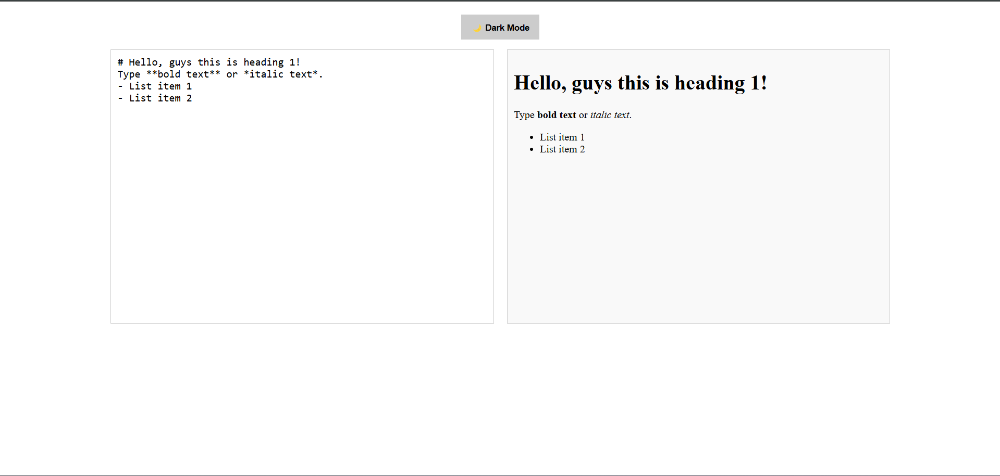
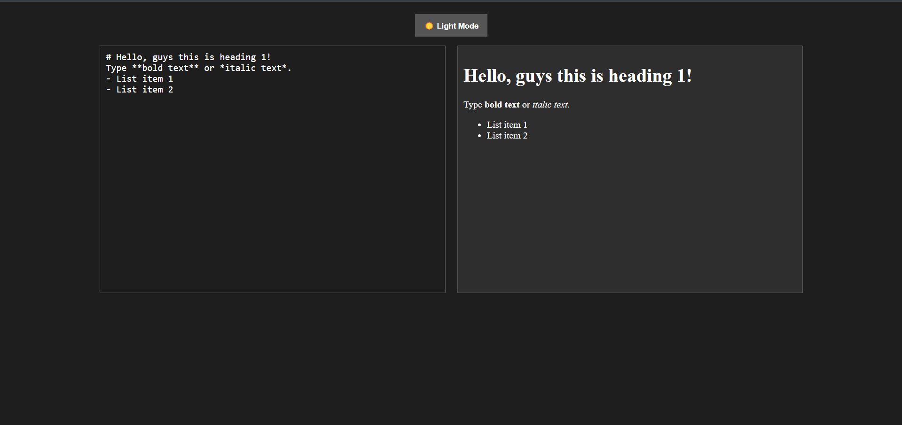

# Markdown Previewer 

## Application Features

✅ Dark Mode / Light Mode toggle

✅ Live Markdown rendering

✅ Responsive design  

## Screenshots

### Main page of site

### Toggle view


### Search functionality


## Deployment Link

[Live Demo](https://aj-markdown.netlify.app/)

## How to Run Locally

1. Clone the repository:
   ```sh
   git clone https://github.com/AJTITAN/markdown-preview.git
   ```
2. Open `index.html` in your browser:
   ```sh
   open index.html
   ```

## Technologies Used

- **HTML** for structure
- **CSS** for styling
- **JavaScript** for interactivity


